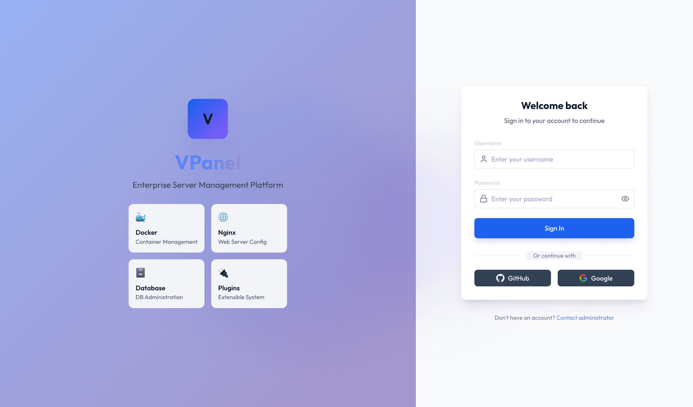

# VPanel - Enterprise Server Management Panel

<div align="center">
  <h1>🚀 VPanel</h1>
  <p><strong>Next-Generation Intelligent Server Operations Management Platform</strong></p>
</div>

```
██╗   ██╗██████╗  █████╗ ███╗   ██╗███████╗██╗     
██║   ██║██╔══██╗██╔══██╗████╗  ██║██╔════╝██║     
██║   ██║██████╔╝███████║██╔██╗ ██║█████╗  ██║     
╚██╗ ██╔╝██╔═══╝ ██╔══██║██║╚██╗██║██╔══╝  ██║     
 ╚████╔╝ ██║     ██║  ██║██║ ╚████║███████╗███████╗
  ╚═══╝  ╚═╝     ╚═╝  ╚═╝╚═╝  ╚═══╝╚══════╝╚══════╝
```

<div align="center">
  
</div>

## ✨ Core Features

### 🔌 Plugin Architecture
- Dynamic plugin loading/unloading
- Official plugin marketplace
- Custom plugin development SDK
- Plugin dependency management

### 🐳 Docker Management
- Full container lifecycle management
- Docker Compose orchestration
- Image management and building
- Container logs and terminal
- Resource limits and monitoring

### 🌐 Nginx Management
- Visual site configuration
- Automatic SSL certificate provisioning (Let's Encrypt)
- Reverse proxy configuration
- Load balancing management
- Real-time access log analysis

### 🗄️ Database Management
- MySQL/MariaDB management
- PostgreSQL management
- Redis/MongoDB support
- Backup and restore
- Performance monitoring

### 📦 Software Management
- One-click install/uninstall
- Version management and updates
- Software store
- Custom software repositories

### 📊 System Monitoring
- Real-time performance monitoring
- Historical data analysis
- Alert notifications
- Multi-node management

### 🔐 Security Management
- Firewall management
- Fail2Ban integration
- SSH key management
- Security audit logs

### 📁 File Management
- Web file manager
- Online code editor
- Permission management
- Compress/decompress

### 💻 Terminal Management
- Web SSH terminal
- Multi-session support
- Command history
- Collaborative terminal

### ⏰ Scheduled Tasks
- Visual Cron management
- Task logs
- Execution history
- Task templates


## 🚀 Quick Start

### One-Click Installation
```bash
curl -sSL https://vpanel.zsoft.cc | bash
```


### Development Environment
```bash
# Clone repository
git clone https://github.com/your-org/vpanel.git
cd vpanel

# Start backend
cd server && go run ./cmd/server

# Start frontend (new terminal)
cd web && npm install && npm run dev
```


## 📦 Plugin Development

VPanel provides a powerful plugin system that allows developers to extend panel functionality.

### Plugin Types
1. **Service Plugins** - Install and manage specific services
2. **Tool Plugins** - Provide additional management tools
3. **Monitoring Plugins** - Extend monitoring capabilities
4. **Theme Plugins** - Customize UI themes

### Development Example
```go
package main

import (
    "github.com/vpanel/sdk-go/plugin"
)

func main() {
    p := plugin.New(&plugin.Config{
        ID:          "my-plugin",
        Name:        "My Plugin",
        Version:     "1.0.0",
        Description: "A custom plugin for VPanel",
    })

    // Register API routes
    p.RegisterRoute("GET", "/status", handleStatus)
    
    // Register menu items
    p.RegisterMenu(&plugin.MenuItem{
        Title: "My Plugin",
        Icon:  "plugin",
        Path:  "/plugins/my-plugin",
    })

    p.Run()
}
```


## 🔒 Security Features

- **Multi-Factor Authentication (MFA)** - TOTP support
- **RBAC Permission Control** - Fine-grained permission management
- **API Key Management** - Secure API access
- **Audit Logs** - Complete operation records
- **Encrypted Storage** - Sensitive data encryption
- **Automatic Security Updates** - Automatic vulnerability fixes


## 📄 License

Apache License 2.0


## ⭐ Star History

<div align="center">
  <p>
    <a href="https://github.com/zsai001/vpanel/stargazers">
      
    </a>
    <a href="https://github.com/zsai001/vpanel/forks">
      
    </a>
  </p>
  
  <p>
    <a href="https://star-history.com/#zsai001/vpanel&Date">
      <picture>
        <source media="(prefers-color-scheme: dark)" srcset="https://api.star-history.com/svg?repos=zsai001/vpanel&type=Date&theme=dark" />
        <source media="(prefers-color-scheme: light)" srcset="https://api.star-history.com/svg?repos=zsai001/vpanel&type=Date" />
        
      </picture>
    </a>
  </p>
</div>

<div align="center">
  <p>Made with ❤️ by VPanel Team</p>
</div>

